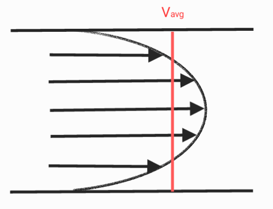
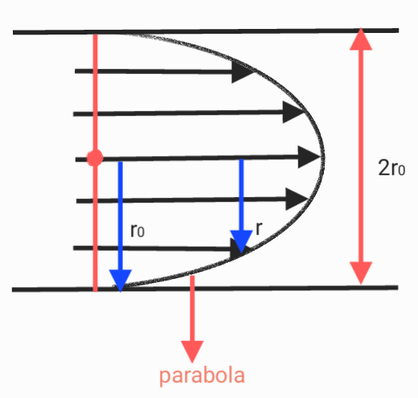
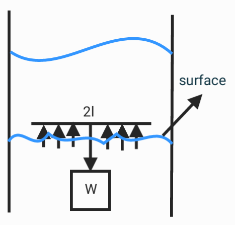
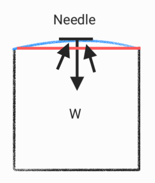
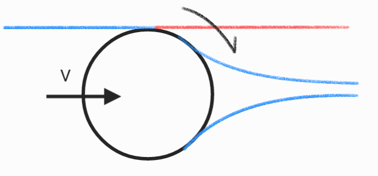
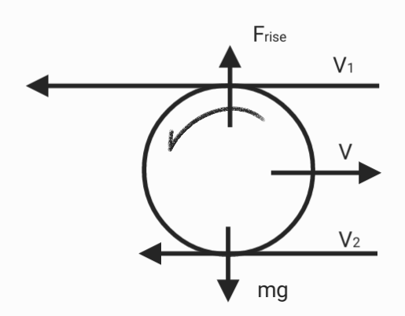
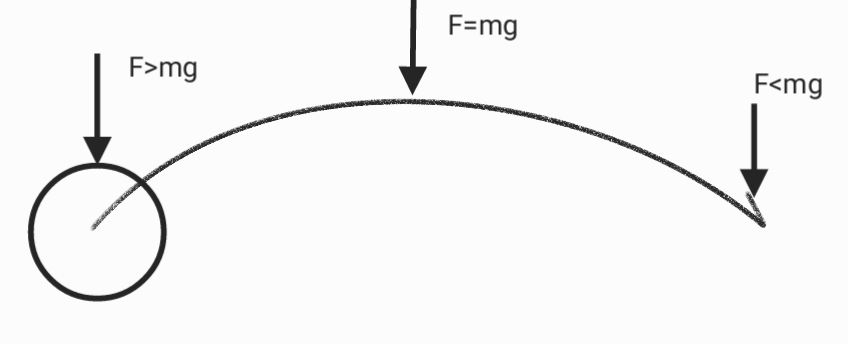

# Fluid properties

Real fluids exhibit viscosity and surface effects that ideal-fluid models omit. The sections compare flow profiles, dimensionless flow measures, and forces associated with fluid motion.

## Viscous foece

$$\boxed{F = \mu A\frac uy}$$

* velocity of the fluid : $u$
* viscosity : $\mu$ , $(\frac{M}{TL})$

$$\tau = \frac FA$$

$$\tau = \mu\frac{𝜕u}{𝜕y}$$

* Kinematic viscosity : $\nu$

$$\boxed{\nu = \frac{\mu}{\rho}}$$

## Turbulent power-law

* velocity of the fluid : $u$
* Location radius : $r$

$$\frac{u}{u_{\max}} = (1-\frac{r}{R})^{1/n}$$

## Raynolds number

* Raynolds number : $Re$

$$Re = \frac{inertial force}{viscous force}$$

* length (e.g., diameter of a pipe) : $L$

$$Re = \frac{\rho uL}{\mu} = \frac{uL}{\nu}$$

The higher the viscosity $\mu$, the more easily the fluid is affected by the pipe wall.

## Velocity of the fluid

$$\boxed{u = \frac{1}{4\mu}\frac{dP}{dx}(r_o^2-r^2)}$$

* Pressure gradient : $\frac{dP}{dx}$
This is the main force that propels the fluid to flow along the pipe
* Dynamic viscosity : $𝜇$
viscosity represents the friction inside the fluid.
* Velocity distribution :  $r_0^2−r^2$
velocity changes with radial distance.

## Hagen-Poiseuille equation

$$Q = \int_{0}^{r_0}u(r)2\pi rdr$$

* viscous flow rate : $Q$

$$= \int_{0}^{r_0}\frac{1}{4\mu}\frac{dP}{dx}(r_o^2-r^2)2\pi rdr$$

$$= \frac{2\pi}{4\mu}\frac{dP}{dx}\int_{0}^{r_0}(r_o^2r-r^3) r dr$$

$$\frac{2\pi}{4\mu}\frac{dP}{dx}\int_{0}^{r_0}(r_o^2r-r^3) r dr$$

$$= \frac{2\pi}{4\mu}\frac{dP}{dx}(\int_{0}^{r_0}r_o^2rdr-\int_{0}^{r_0}r^3dr)$$

$$=\frac{2\pi}{4\mu}\frac{dP}{dx}(\frac{r_0^4}{2}-\frac{r_0^4}{4})$$

$$=\frac{2\pi}{4\mu}\frac{dP}{dx}\frac{r_0^4}{4}$$

$$\boxed{Q = \frac{\pi r^4_0}{8\mu}(\frac{dP}{dx})}$$

## Surface Tension

$$2\gamma L = F_y$$

* suface tension per unit lenght : $\gamma$
* perimeter of the Object : $L$

$$2\gamma L+V\rho = F_y+F_b = w$$

* The weight of an object supported by surface tension : $w$

$$\boxed{\gamma = \frac{2L}F}$$

## Lift and Drag

* **Lift**

$$\boxed{F_L = C_L(\frac12\rho A_N)u^2}$$

* **Drag**

$$\boxed{F_D = C_D(\frac12\rho A_N)u^2}$$

## Coandă effect

The Coandă effect is the tendency of a fluid jet to stay attached to a surface of any form.

## Magnus Effect

* Linear motion

$$F_L =C_L(
\frac12\rho A_N)u^2 =  C_L(\frac12\rho A_N)v^2$$

* Linear motion and rotation

$$\boxed{F_L' = C_L(\frac12\rho A_N)(v+\omega r)^2}$$

