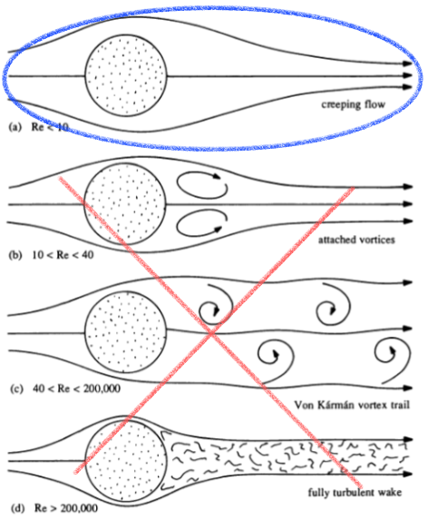
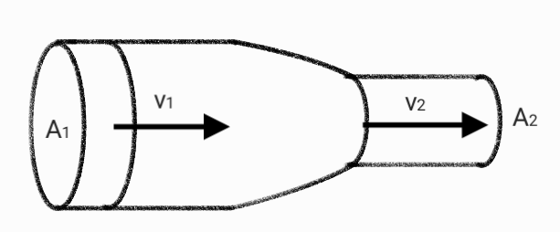
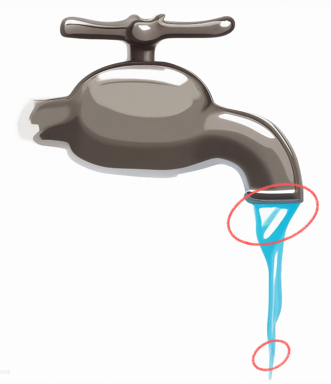
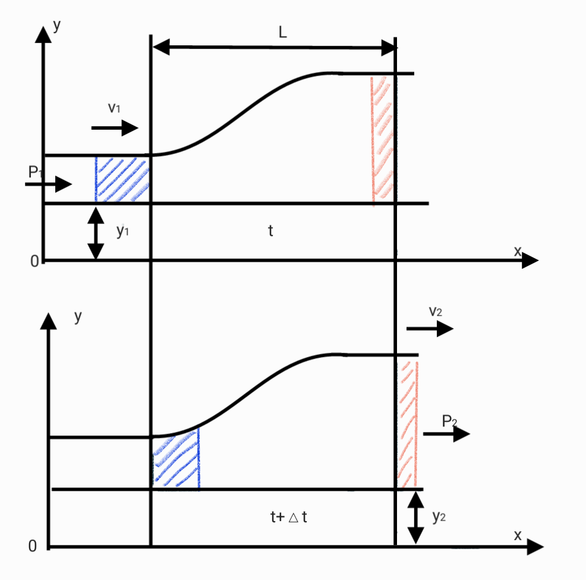

# Ideal fluid

1. **Steady Flow (Laminar Flow):** The flow parameters (velocity, pressure, density, etc.) at any point do not change over time.
2. **Constant Velocity:** The velocity of the fluid particles does not change over time at a given point.
3. **Incompressible:** The fluid has a constant and uniform density, meaning it does not compress under pressure.
4. **Inviscid Flow:** The fluid has no viscosity, meaning there is no internal friction between fluid layers.
5. **No Conversion of Kinetic Energy to Heat:** The fluid's kinetic energy is not converted into heat energy, meaning there is no energy loss due to friction or viscosity.
6. **Frictionless:** There is no friction between the fluid and the boundaries it flows along.
7. **Non-Swirling Flow:** The velocity field can be represented by a scalar potential, meaning there is no rotational component to the flow (no vortices).

## continuous equation

Volume : $V$
Velocity : $v$
$$\Delta V = A\Delta x = Av\Delta t$$

$$\Delta V = A_1v_1\Delta t = A_2v_2\Delta t$$

$$A_1v_1 = A_2v_2$$

$Av$ is a constant. consider density >> $\rho Av$ is a constant.

## Bernoulli equation

$$W_K = \Delta K$$

$$\Delta K = \frac12\Delta mv^2_f-\frac12\Delta mv^2_i$$

$$= \frac12\rho\Delta V(v_f^2-v_i^2)$$

$$W_g = -\Delta mg(y_f-y_i)$$

$$= -\rho\Delta Vg(y_f-y_i)$$

$$W_p = F\Delta x = (PA)\Delta x$$

$$P(A\Delta x) = P\Delta V$$

$$W_p = -P_f\Delta V+P_i\Delta V$$

$$=-(P_f-P_i)\Delta V$$

$$W=  W_g+W_p = \Delta K$$

$$-\rho \Delta Vg(y_f-y_i)-\Delta V(P_f-P_i) = \frac12\rho\Delta V(v_f^2-v_i^2)$$

$$P+\frac12\rho v^2+\rho gy = constant$$
