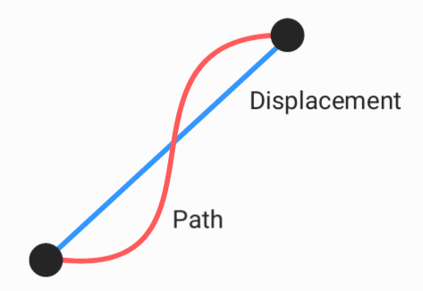
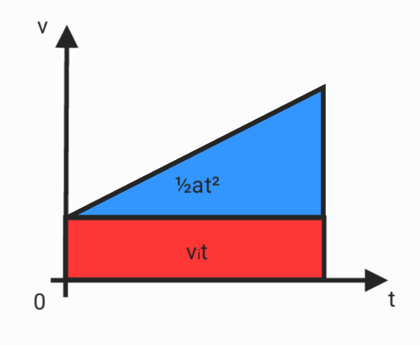
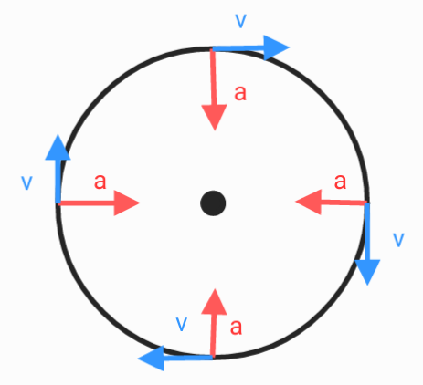
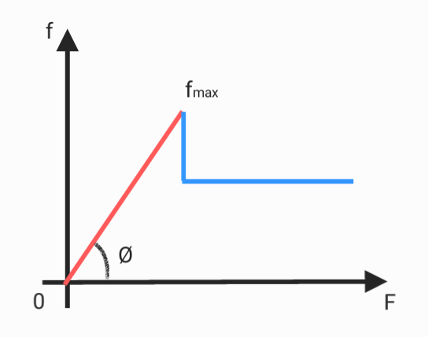
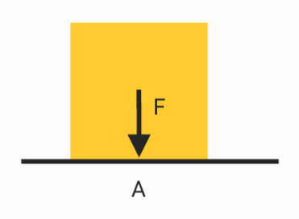
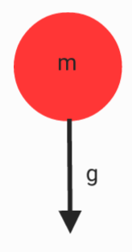

# Force & motion

## linear motion

$$speed = \frac{path}{time} \qquad velocity = \frac{Displacement}{time}$$

$$v = \frac{dx}{dt}$$

$$a = \frac{dv}{dt}$$

$$v_f = v_i+at$$

$$x = x_i+v_it+\frac{1}{2}at^2$$

## circular motion

$$v = 2\pi/t$$

$$a = v^2/r$$

## Rotation
$$\omega = \frac{d\theta}{dt}$$

$$\alpha = \frac{d\omega}{dt}$$

$$\theta_f = \theta_i+\alpha t$$

$$\theta = theta_i+\omega_it+\frac{1}{2}\alpha t^2$$
## Force
* Newton's laws of motion
1. if $F = 0$ , then $v_i = v_f$
2. $F = ma$
3. $F_{ab} = -F_{ba}$

$$F = \sqrt{F_x^2+F_y^2+F_z^2}$$
## Center of Mass & Momentum
* Center of Mass
$$r_{com} =\sum\frac{m_ir_i}{m_i} $$
* Momentum
$$p = mv$$
* Impulse
$$J = \Delta p$$
## Elasticity
$$F = kx$$

## Friction

$$f = \mu N$$

## Backward force
$$D_1 = Bv$$

$$D_2 = \frac{1}{2}C\rho Av^2$$
## Pressure

$$P = \frac{F}{A}$$

## Buoyancy
$$F_b = VD$$

## Gravity

$$W = mg$$
$$F_g = \frac{GMm}{r^2}$$

## Coulomb's law
$$F_e = \frac{kQq}{r^2} = \frac{Qq}{4\pi\epsilon_0r^2}$$

## Magnetism
$$F_B = qv\times B$$

## Torque
$$\tau = r\times F$$

## Work & Energy
$$W = F\cdot x$$

* **kinetic energy**
$$K = \frac{1}{2}mv^2$$
* **gravitational potential energy**
$$U_g = gmh$$
* **Elastic potential energy**
$$U_s = \frac{1}{2}kx^2$$
## Power
$$P = \frac{E}{t}$$