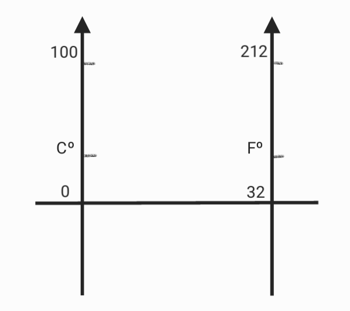
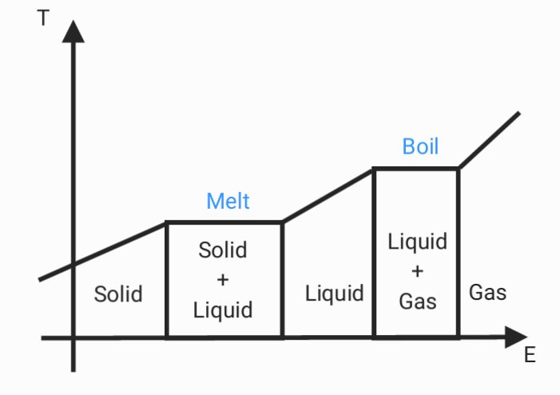

# heat

## Specific heat

$$Q=mc\Delta T$$

$Q =$ heat energy
$m =$ mass
$c =$ specific heat capacity
$\Delta T =$ change in temperature

## Temperature conversion

$$\frac{C^o}{100} = \frac{F^o-32}{180}$$

## Heat transfer

|   Method   |  Solid  | Liquid | Gas     |
|:----------:|:-------:|:------:| ------- |
| Conduction | fastest | middle | slowest |
| convection | slowest | middle | fastest |

radiation : The higher the temperature, the faster the heat transfer

## Energy and temperature

