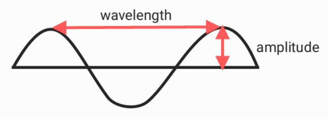
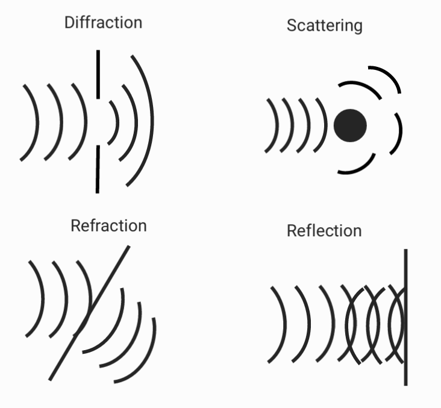

# Wave

**transverse wave**

**longitudinal wave**

## Period & frequency

$$f = \frac{1}{T}$$

$$f = v/λ$$

## Decibel

$$dB=10\times log_{10}(\frac{P}{P_{ref}})$$

$P =$ sound pressure
$P_{ref} =$ refer sound pressure

## Characteristic of wave

* Reflection :
Reflection happens when a wave bounces off a surface and changes direction.

* Refraction :
Refraction is the bending of a wave as it passes from one medium to another.

* Diffraction :
Diffraction happens when a wave encounters an obstacle.

* Scattering :
Scattering is the process by which waves are deflected in various directions when they interact with a surface.

