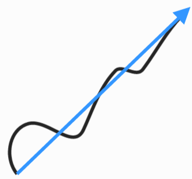
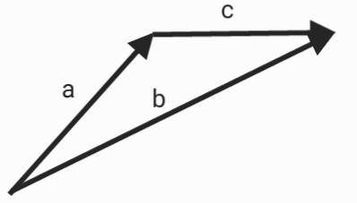
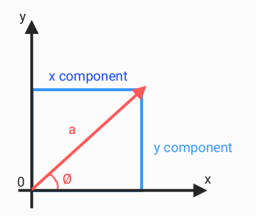
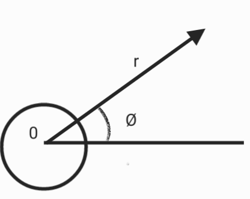
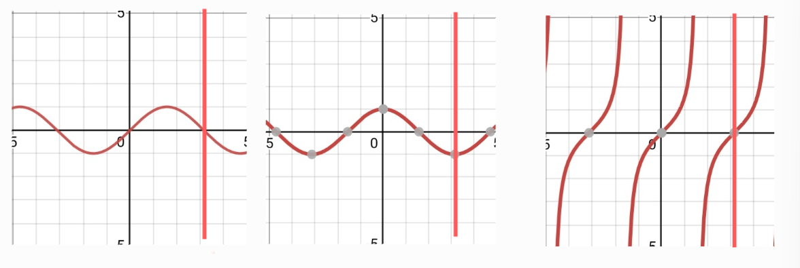

# Vector

Vector has to be expressed by both magnitude and direction.

## Addition & subtraction

$$\vec a+\vec b = \vec b+\vec a$$

$$\vec a+(\vec b+\vec c) = (\vec a+\vec b)+\vec c$$

$$\vec a-\vec b = \vec a+(-\vec b)$$

## Coordinate system

$XY$ coordinate system : $(x,y)$
$r\theta$ coordinate system : $(r,\theta)$

## Trigonometric functions

angle $⟹$ radian

|   Angle   |      Radian       |
|:---------:|:-----------------:|
| $$360^o$$ |     $$2\pi$$      |
| $$180^o$$ |      $$\pi$$      |
| $$90^o$$  | $$\frac{\pi}{2}$$ |

* $r = \sqrt{x^2+y^2}$

* $cos(\theta) = \frac{x}{r}$

* $sin(\theta) = \frac{y}{r}$

* $tan\theta = \frac{x}{y} =\frac{sin(\theta)}{cos(\theta)} = m$
slop : $m$

* $x = r\cdot cos(\theta)$

* $y = r\cdot sin(\theta)$

* Trigonometric Graphs

## 3D vector

$$\vec a = a_x\vec i+a_y\vec j+a_z\vec k$$

* unit vector (a) $= \frac{\vec a}{a}$

* unit vector (x,y,z) : $\vec x,\vec y,\vec z$ or $\vec i,\vec j, \vec k$

## Inner product

* $\vec a\cdot\vec b = (ab)cos(\theta)$
if $\theta = 90^o$ then $\vec a\cdot\vec b = 0$
$\vec x\cdot\vec y = 0$

* $\vec a\cdot\vec b =a_xb_x+a_yb_y+a_zb_z = (\vec a_x+\vec a_y+\vec a_z)\cdot(\vec a_x+\vec a_y+\vec a_z)$

## outer product

* if $\vec a\times\vec b = \vec c$
$c = (ab)sin(\theta)$
if $\theta = 0$ then $\vec c = \vec 0$

* $\vec a\times\vec b = -\vec b\times\vec a$
$\vec a\times\vec b \not= \vec b\times\vec a$

* $\vec a\times\vec b = (a_yb_z-b_ya_z)\vec i+(a_zb_x-b_za_x)\vec j+(a_xb_y-b_xa_y)\vec k =
\begin{vmatrix}
\vec i & \vec j & \vec k\\
a_x & a_y & a_z \\
b_x & b_y & b_z
\end{vmatrix}$
