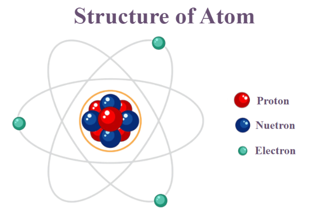
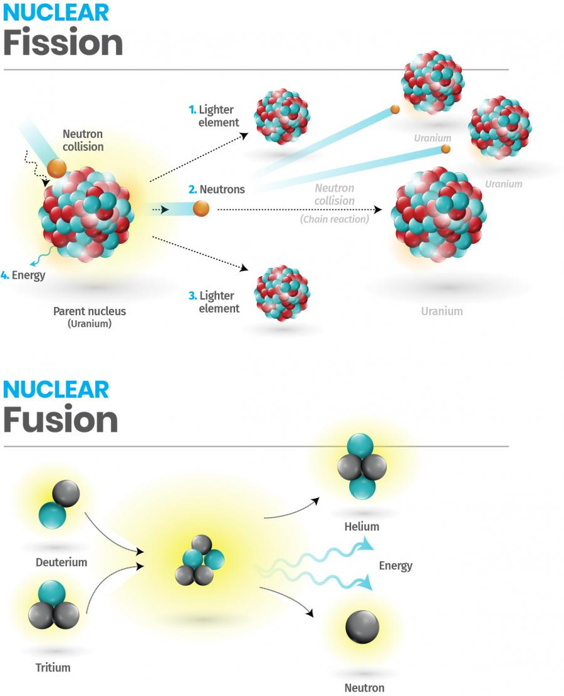
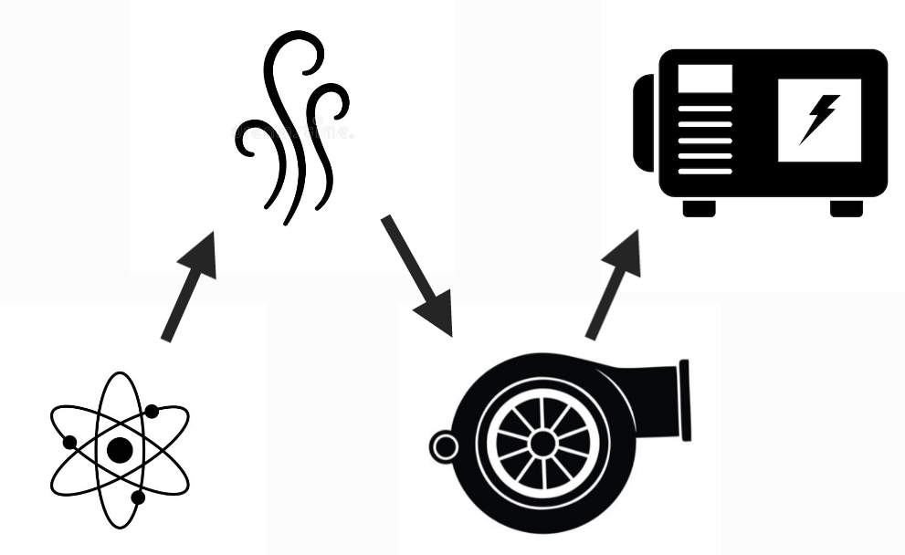

# Fundamental interaction & Nuclear physics

## State

| state  | velocity | temperature |
|:------:|:--------:|:-----------:|
| solid  |   low    |     low     |
| liquid |  medium  |   medium    |
|  gas   |   high   |    high     |

* Solid:
At low temperatures, matter is in a solid state. The molecular motion is low, with molecules mainly vibrating in fixed positions.

* Liquid:
As the temperature increases, matter enters a liquid state. The molecular motion is moderate, allowing molecules to move freely within a small range.

* Gas:
With further increase in temperature, matter becomes gaseous. The molecular motion is high, and molecules move freely throughout the entire container, with fast and widely distributed velocities.

## Energy and interaction within the atom

> https://www.geeksforgeeks.org/what-is-an-atom/

**interaction**

* Strong interaction
Maintain stability within the nucleus
* Weak interaction
nuclear reaction

**energy**
Atomic mass $\simeq$ Nucleus mass $\simeq$ Nuclear energy
$$E = mc^2$$

## Nuclear reaction

> https://www.ansto.gov.au/news/fission-vs-fusion-an-explainer

## Nuclear power plant

1. **Reactor**(nuclear energy)
1. **Steam**(thermal energy)
1. **Turbine**(kinetic energy)
1. **Electric generator**(Electric energy)

## Fundamental interaction

|   Interaction   |   Mediators    | Relative strength | Long-distance behavior (potential) |  Range (m)   |
|:---------------:|:--------------:|:-----------------:|:----------------------------------:|:------------:|
|      Weak       | W and Z bosons |    $$10^{33}$$    | $${\frac {1}{r}}e^{-m_{(W,Z)}r}$$  | $$10^{-18}$$ |
|     Strong      |     gluons     |    $$10^{38}$$    |             $$\sim r$$             | $$10^{-15}$$ |
|   Gravitation   |   gravitons    |         1         |         $$\frac{1}{r^2}$$          |  $$\infty$$  |
| Electromagnetic |    photons     |    $$10^{36}$$    |       $$\frac{1}{r^{2.04}}$$       |  $$\infty$$  |
