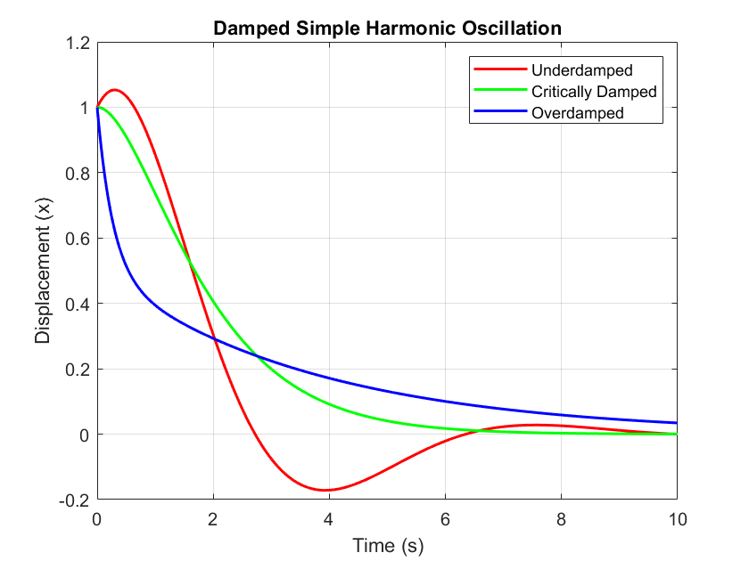

# Damping harmonics motion

Damping removes energy from an oscillating system. The response depends on the balance between inertia, stiffness, and damping, producing underdamped, critical, or overdamped motion.

common harmonics

* $x(t)$ : $x_mcos(\omega t+\phi)$
* $v(t)$ : $-\omega x_msin(\omega t+\phi)$
* $a(t)$ : $-\omega^2x_mcos(\omega t+\phi)$

## Damping force

* Damping force : $F_d = D_1(\text{backward force})$
* Damping coefficient : $b$

$$F_d = -bv$$

$$F_{net} = F_d+F_s$$

$$ma = -kx-bv$$

$$m\frac{d^2x}{dt^2}+b\frac{dx}{dt}+kx = 0$$

$$m\ddot x+b\dot x+kx = 0$$

* let $x(t) = e^{𝜆t}$ , $𝜆$ is solution
* then $V = \dot x = \frac{de^{𝜆t}}{dt} =𝜆e^{𝜆t}$ , $a = \ddot x = \frac{d^2e^{𝜆t}}{dt^2} = 𝜆^2e^{𝜆t}$
* and $e^{𝜆t} \not= 0$

$$m𝜆^2e^{𝜆t}+b𝜆e^{𝜆t}+ke^{𝜆t} = 0$$

$$m𝜆^2+b𝜆+k = 0$$

## Overdamping, critical damping, underdamping

$$m𝜆^2+b𝜆+k = 0$$

$$𝜆 = \frac{-b\pm\sqrt{b^2-4mk}}{2m}$$

when $𝜆$ is a real number : $b^2-4mk\ge 0$

$$𝜆_1 = \frac{-b+\sqrt{b^2-4mk}}{2m}$$

$$𝜆_2 = \frac{-b-\sqrt{b^2-4mk}}{2m}$$

$𝜆_1$ & $𝜆_2 < 0$ , then $\mid 𝜆_2\mid>\mid 𝜆_1\mid$
$x_1(t) = C_1e^{-𝜆_1t}$ (major)
$x_2(t) = C_2e^{-𝜆_2t}$ (minor)

$$x(t) = x_1(t)+x_2(t) = C_2e^{-𝜆_2t}+C_1e^{-𝜆_1t}$$

$$x(0) = C_2e^{-𝜆_20}+C_1e^{-𝜆_10}$$

$$v(0) = C_2𝜆e^{-𝜆_20}+C_1ue^{-𝜆_10}$$

$$C_1+C_2 = x_i$$

$$C_1𝜆_1+C_2𝜆_2 = v_i$$

$$C_1 = x_i-C_2$$

$$(x_i-C_2)𝜆_1+C_2𝜆_2 = v_i$$

$$x_i𝜆_1-C_2𝜆_1+C_2𝜆_2 = v_i$$

$$C_2(-𝜆_1+𝜆_2) = v_i-x_i𝜆_1$$

$$\frac{v_i-x_i𝜆_1}{𝜆_1-𝜆_2}\longrightarrow(C_2)$$

$$C_1 = x_i-\frac{v_i-x_i𝜆_1}{𝜆_1-𝜆_2}$$

$$\frac{x_i𝜆_2-v_i}{𝜆_1-𝜆_2}\longrightarrow(C_1)$$

* $b^2-4mk = 0$ : critical damping

$$𝜆 = \frac{-b}{2m}$$

$$x(t) = Ce^{𝜆t} = Ce^{\frac{-bt}{2m}}$$

when $𝜆$ is not a real number : $b^2-4mk < 0$ ( Underdamped )

## Damped oscillation

$$m𝜆^2+b𝜆+k = 0$$

let $2𝛾 = \frac bm,\omega_i^2 = \frac km$
$𝛾$ is the decay rate, in the reciprocal of the time units of the independent variable $t$

$$𝜆^2+2𝛾𝜆+\omega_i^2 = 0$$

$$𝜆 = -𝛾\pm i\omega'$$

$$𝜆 = \frac{-2𝛾\pm\sqrt{4𝛾^2-4\omega_i^2}}{2}$$

$$𝜆 = -𝛾\pm i\sqrt{𝛾^2-\omega_i^2}$$

$$(𝜆+𝛾)i = \sqrt{\omega_i^2-𝛾^2} = \omega'$$

$$\omega'= \sqrt{\frac{k}{m}-\frac{b^2}{4m^2}}$$

$$x(t) = e^{𝜆t} = e^{-t𝛾\pm it\sqrt{\omega_i^2-𝛾^2}}$$

by Euler's formula : $e^{i\theta} = \cos(\theta)+i\sin(\theta)$

$$x(t) = e^{(-\gamma)t} \left( C_1 e^{i\omega' t} + C_2 e^{-i\omega' t} \right)$$

$$x(t) = e^{-\gamma t} \left( C_1 (\cos(\omega' t) + i \sin(\omega' t)) + C_2 (\cos(\omega' t) - i \sin(\omega' t)) \right)$$

$$x(t) = e^{-\gamma t} \left( (C_1 + C_2) \cos(\omega' t) + i (C_1 - C_2) \sin(\omega' t) \right)$$

let $C'_1 = C_1 + C_2$ , $C'_2 = i (C_1 - C_2)$

$$x(t) = e^{-𝛾t}(C_1'cos(\omega't)+C_2'sin(\omega't))$$

by Trigonometric Identities

$$= e^{-\frac {bt}{2m}}x_mcos(\omega't+\phi)$$

## Damping coefficient

1. $b = 2m\sqrt{(\frac{k}{m}-\frac{4\pi^2}{T^2})}$

$$\omega' = \frac{2\pi}{T} = \sqrt{\frac{k}{m}-\frac{b^2}{4m^2}}$$

$$\frac{b^2}{4m^2} = \frac{k}{m}-\frac{4\pi^2}{T^2}$$

$$\frac{b}{2m} = \sqrt{(\frac{k}{m}-\frac{4\pi^2}{T^2})}$$

$$b = 2m\sqrt{(\frac{k}{m}-\frac{4\pi^2}{T^2})}$$

2. $b = \frac{-2m\cdot ln(x)}{t}$

$$e^{-\frac {bt}{2m}} = x$$

$$-\frac {bt}{2m} = ln(x)$$

$$b = \frac{-2m\cdot ln(x)}{t}$$

3.$b = 2m\sqrt{\omega_i^2-\omega'^2}$

$$2𝛾 = \frac bm$$

$$b = 2m𝛾$$

$$\sqrt{\omega_i^2-𝛾^2} = \omega'$$

$$b = 2m\sqrt{\omega_i^2-\omega'^2}$$

* critical damping ($\omega' = 0$)

$$b = 2m\sqrt{\omega_i^2-0}$$

$$b = 2m\omega_i$$

$$b = 2m\sqrt{\frac km}$$

$$\boxed{b = 2\sqrt{km}}$$

## Graph

