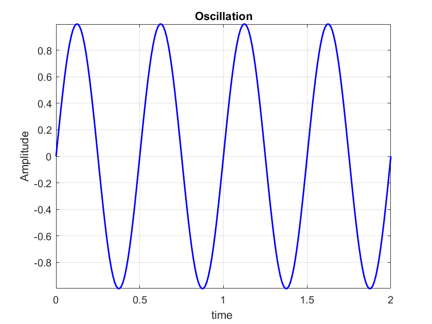
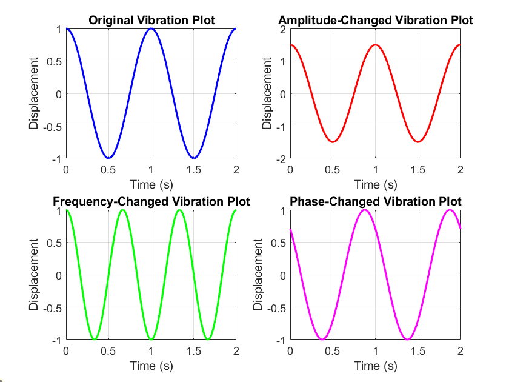

# Oscillation

* equation Displacement versus time : $x(t)$
* amplitude : $x_m$
* angular frequency : $\omega$
* Phase : $\phi$

$$x(t) = x_mcos(𝜔t+\phi)$$

* $x_{max} = x_m$
* $x_{min} = -x_m$

## Cycle VS Frequency

$$T = \frac{1}{f}$$

## Place

$$x(t) = x_mcos(𝜔t+\phi)$$

* if $\phi = 0$ , then $x(t) = x_mcos(𝜔t)$

$$x(t) = x_mcos(𝜔t) = x_mcos𝜔(t+T)$$

$$𝜔(t+T) = 𝜔t+2\pi$$

$$𝜔T = 2\pi$$

$$𝜔 = \frac{2\pi}{T} = 2\pi f$$

## Velocity

$$v(t) = \frac{dx(t)}{dt} = \frac{d}{dt}(x_mcos(𝜔t+\phi))$$

$$v(t) = -𝜔x_msin(𝜔t+\phi)$$

## Acceleratiion

$$a(t) = \frac{dv(t)}{dt} = \frac{d}{dt}(-𝜔x_msin(𝜔t+\phi))$$

$$a(t) = -𝜔^2x_mcos(𝜔t+\phi)$$

$$a(t) = -𝜔^2x(t)$$

## Graph

