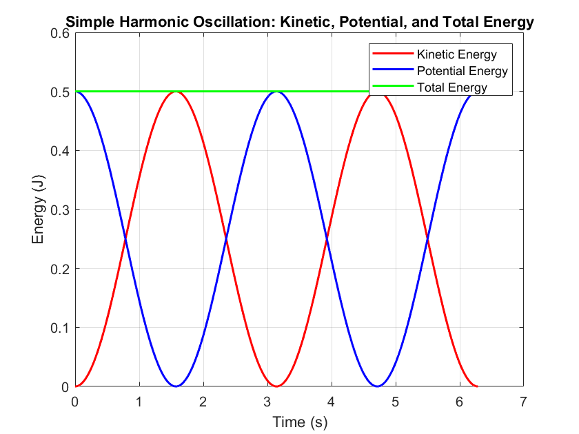

# Simple Harmonic Oscillation

Simple harmonic motion occurs when the restoring force is proportional to displacement from equilibrium. The spring–mass model shows how kinetic and potential energy alternate during a cycle.

$$F = ma = m\frac{v^2}{r} = m\omega^2r$$

$$F = kr$$

$$m\omega^2r = kr$$

$$k = m\omega^2$$

$$\boxed{\omega = \sqrt{\frac{k}{m}}}$$

* [How to solve SHM by ODE ?](../../../Special/SHM_ODE.md)

$$T = 2\pi/\omega = 2\pi\sqrt{\frac{m}{k}}$$

* Consider the mass of the spring ($m_s$):
[why ??](../../../Special/spring.md)

$$\boxed{T = 2\pi\sqrt{\frac{m+\frac{1}{3}m_s}{k}}}$$

## Energy

Identify the energy stored in each part of the system and the transfers across its boundary.

$$U(t) = \frac{1}{2}kx^2 = \frac{1}{2}kx_m^2cos^2(\omega t+\phi)$$

$$K(t) = \frac{1}{2}mv^2 = \frac{1}{2}m\omega^2x_m^2sin^2(\omega t+\phi)$$

$$K(t) = \frac{1}{2}kx_m^2sin^2(\omega t+\phi)$$

$$E = K+U$$

$$E = \frac{1}{2}kx_m^2sin^2(\omega t+\phi)+\frac{1}{2}kx_m^2cos^2(\omega t+\phi)$$

$$= \frac{1}{2}kx_m^2(sin^2(\omega t+\phi)+cos^2(\omega t+\phi))$$

* because $sin^2x+cos^2x = 1$

so $E = U+K = \frac{1}{2}kx_m^2$

## Graph

