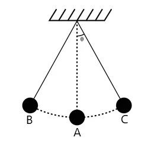

# simple harmonic pendulum

Pendulum motion can be approximated as simple harmonic motion for sufficiently small angular displacements. The period relationships depend on the pendulum geometry and restoring torque.

>by https://unacademy.com/content/nda/study-material/physics/pendulum/

$$\tau = -k\theta$$

$$\boxed{T = 2\pi\sqrt{\frac{I}{k}}}$$

## Swing motion

* $F_T = F_gcos\theta$

$(F_T)^2+(F_gsin\theta)^2 = F_g^2$

$$\tau = I\alpha = LF_gsin\theta$$

$$\alpha = \frac{mgL}{I}sin\theta$$

* if $\theta << 1$ , $sin\theta \simeq \theta$

$$\alpha = \frac{mgL}{I}\theta$$

$$\omega = \sqrt{\frac{mgL}{I}}$$

$$T = 2\pi\sqrt{\frac{I}{mgL}}$$

$$I = mr^2$$

$$T = 2\pi\sqrt{\frac{mL^2}{mgL}}$$

$$\boxed{T = 2\pi\sqrt{\frac{L}{g}}}$$

## Gravity measurement

$$T = 2\pi\sqrt{\frac{L}{g}}$$

$$(\frac{T}{2\pi})^2 = \frac{L}{g}$$

$$\frac{4\pi^2}{T^2} = \frac{g}{L}$$

$$\boxed{g = \frac{4\pi^2L}{T^2}}$$
