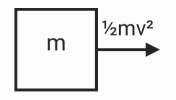
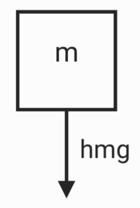
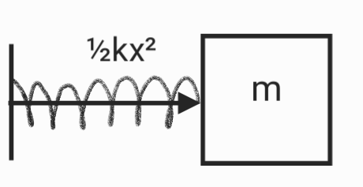
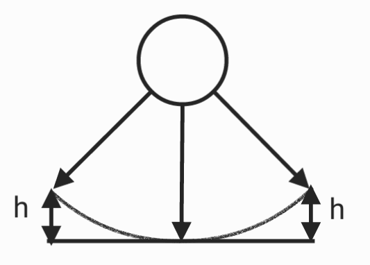
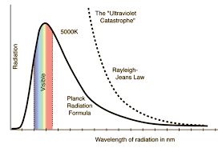

# Energy

## Work

$W = \vec F\cdot \vec x = Fxcos\theta$

if $\theta = 90^o , W = 0$

if $\theta > 90^o , W < 0$

if $\theta < 90^o , W > 0$

$\theta =0 , W = Fx$
## Potential energy & kinetic energy
* Kinetic energy

$K = \frac{1}{2}mv^2$
* Gravitational potential energy

$U_g = mgh$
* Elastic potential energy

$U_k = \frac{1}{2}kx^2$
* Electric energy
$U = QV$
## Conservation of mechanical energy

* $U_i+K_i = U_f+K_f$
* $\frac{1}{2}mv_i^2+mgh_i = \frac{1}{2}mv_f^2+mgh_f$
## Mass-energy equivalence
* $E = mc^2$
## Black-body radiation

* energy discontinuous

$B_{\nu}(\nu, T)=\frac{2 h \nu^{3}}{c^{2}} \frac{1}{e^ {\frac {h \nu} {k T}}-1}$

$B_{\nu}(\nu, T) =$spectral radiance

$h=$ Planck constant

$\nu =$ frequency of the electromagnetic radiation

$c =$ speed of light in a vacuum

$k =$ Boltzmann constant$

$T =$ absolute temperature of the body

## Photoelectric effect

$E = hf$

$E =$ energy

$h =$ Planck constant

$f =$  frequency

## Wave-particle duality

The larger the mass, the more obvious of particle nature
