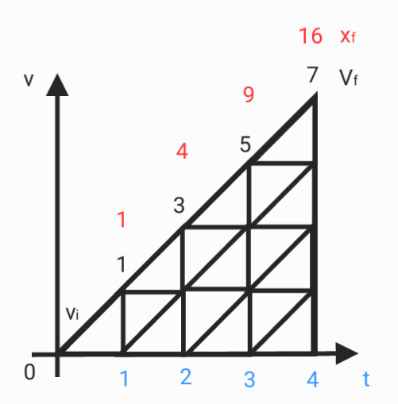
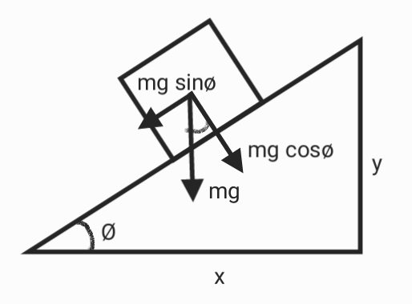
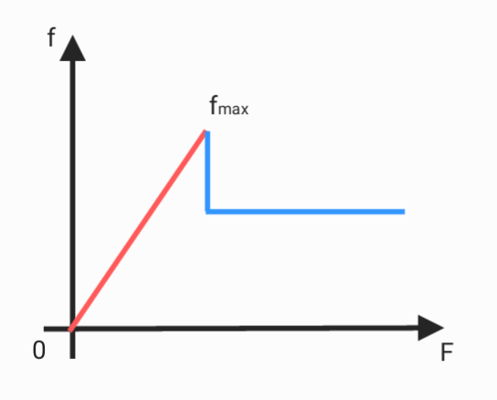
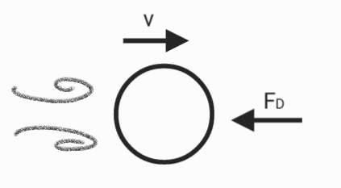
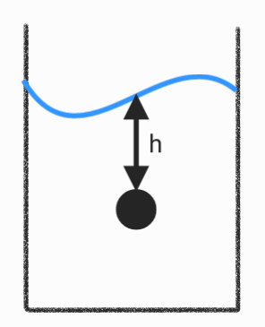
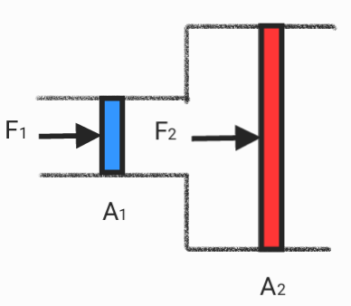

# Mechanics

## Newton's laws of motion

1.  $\vec{F_{net}} = 0 \qquad Δ\vec{v} = 0	\qquad a = 0$
2.  $F = ma$
3.  $\vec{F_{ab}} = -\vec{F_{ba}}$

## Laws of thermodynamics

1. $K_i+U_i+Q_i = K_f+U_f+Q_f$
2. Entropy ( $S$ ) increases in natural processes , $dQ = T\cdot dS$
3. $\lim_{T \to 0} S = 0$

## Kepler's laws of planetary motion

1. the sun is at the focus of the elliptical orbit of planetary motion 
2. $\frac{dA}{dt}$ is a constant
3. $\frac{T^2}{r^3}$ is comstant

## Gravity

* $\frac{GMm}{r^2}$

## Conservation of mechanical energy

* $U_i+K_i = U_f+K_f$

## Circular motion

* $v = 2\pi r/t$
* $a = v^2/r$

## Linear motion
* $a = \frac{dv}{dt}$
* $v = \frac{dx}{dt}$
* $x = x_i+v_it+\frac{1}{2}at^2$

## Momentum
* $P = mv$
* $P_i = P_f$
* $J = \Delta P$

## Free fall

* $\Delta h \propto t^2$
* $\Delta h = \frac12gt^2$

## Torque
* $𝜏 = r\times F$

## Slope

* $N = mg\cdot cos\theta$
* $F_s = mg\cdot sin\theta$

## Resistance

* $f = \mu N$

* $D_1 = Bv$
* $D_2 = \frac{1}{2}C_pAv^2$

## Pressure
* $P = \frac{F}{A}$

* $P = \rho g h$

* $\frac{F_1}{A_1} = \frac{F_2}{A_2}$
## Buoyancy
* $F_b = \rho gV$

## spring
* $F = kx$