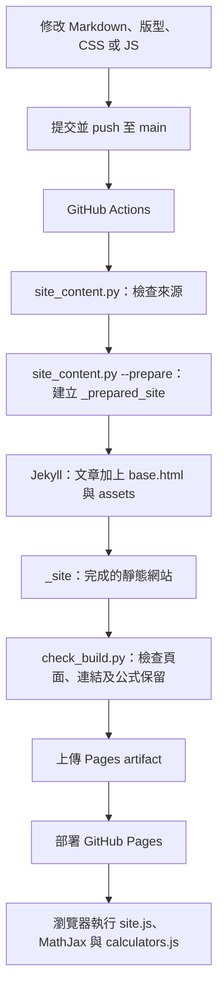

# 網站建置、工具與版型維護說明

本文依本專案 2026-10-02 的程式與設定整理。實際工具目錄名稱是 **`tools`**。所有範例指令以專案根目錄為工作目錄；Windows 使用 PowerShell 與 `python`，GitHub Actions 的 Ubuntu 使用 `python3`。

原始 Markdown 保存文章與計算機設定，`tools` 負責整理及檢查；Jekyll 使用 `_layouts` 組合 HTML；讀者開啟網頁後，`assets` 裡的 CSS 與 JavaScript 才負責外觀、公式顯示、大綱及計算機互動。

**下次部署時先看第 4 節的操作流程，執行指令細節看第 6 節，最後用第 10 節的清單確認。** 本文已更新為 RCVD 納入公開建置的本機設定；線上發布是否成功仍以對應提交的 Actions 結果為準。

## 1. 整體流程



`_prepared_site` 是建置用來源副本，`_site` 是產出的網站。文章修改應在原始 `.md`；直接修改這兩個產出目錄，下一次重新建置會失去修改。

## 2. GitHub workflow 如何啟動

設定檔：[.github/workflows/jekyll-gh-pages.yml](.github/workflows/jekyll-gh-pages.yml)。

| 啟動方式 | 現有設定 |
| --- | --- |
| 自動啟動 | 推送到 `main` 分支時執行 |
| 手動啟動 | 已設定 `workflow_dispatch`，可在 GitHub 儲存庫的 Actions 選擇此 workflow，再使用 Run workflow |
| Pull request | 目前沒有設定 `pull_request` 觸發事件 |
| 本機儲存檔案 | 不會自行觸發部署；必須先提交、推送，或手動執行已在 GitHub 上的 workflow |

workflow 名稱是 `Deploy Jekyll with GitHub Pages dependencies preinstalled`。部署設定使用 `github-pages` environment；`contents: read` 用於讀取程式碼，`pages: write` 與 `id-token: write` 用於 Pages 部署。`concurrency` 將執行歸在 `pages` 群組，且 `cancel-in-progress: false` 不會因新執行而取消正在進行的部署。

### build 工作的步驟

| 順序 | 步驟 | 實際作用 |
| --- | --- | --- |
| 1 | `actions/checkout@v4` | 取得此次執行對應的儲存庫內容 |
| 2 | `actions/configure-pages@v5` | 取得 Pages 設定，包括網址基底路徑 |
| 3 | `python3 tools/site_content.py` | 檢查 Markdown、公式分隔符與本機連結；發現問題時回傳失敗狀態 |
| 4 | `python3 tools/site_content.py --prepare _prepared_site` | 複製發布清單內的檔案，整理成 Jekyll 輸入 |
| 5 | `actions/jekyll-build-pages@v1` | 從 `_prepared_site` 建置到 `_site` |
| 6 | `python3 tools/check_build.py` | 檢查產出頁面；workflow 將 Pages 的 `base_path` 傳入 `SITE_BASEURL` |
| 7 | `actions/upload-pages-artifact@v3` | 上傳網站產物，供下一個工作部署 |

### deploy 工作

`deploy` 設有 `needs: build`，因此只有 build 成功後才會執行 `actions/deploy-pages@v4`。**push 成功只代表 Git 接收成功，不代表網站已部署成功。** 若檢查或建置失敗，網站通常仍保留上一次成功部署的內容。

排查時在 Actions 開啟最新一次執行，查看第一個失敗步驟的日誌。先判斷是來源檢查、Jekyll、產出檢查，還是部署階段，再修改對應檔案。

## 3. 哪些檔案會發布

發布範圍由 [tools/site_content.py](tools/site_content.py) 的 `prepare()` 決定。現有清單是：

```python
public = [
    '_layouts', 'assets', 'Mechanical_Principle', 'Mechanics_Advanced',
    'Mechanics_Mechanical', 'Mechanics_Physics', 'Special', 'RCVD'
]
```

另外會複製根目錄的 `_config.yml`、`README.md`、`LICENSE`。**並非所有已提交的資料夾都會自動成為網站的一部分。**

整理過程還會：

1. 從網站版 README 刪除指向 `Private/Private.md` 的連結，保留原始 README 不變。
2. 為網站首頁加入 `permalink: /`。
3. 對已有 front matter 的文章，視情況從第一個一級標題補上 `title`。
4. 將程式碼區塊以外的行內數學改成 Kramdown 可處理的格式，維持獨立公式。
5. 將本機 Markdown 連結轉為 `.html`，並把 `README.html` 換成 `index.html`。
6. 對公式中的 Liquid 特殊片段加上保護，避免被模板系統誤解。

### RCVD 與 Private 的現況

- **RCVD**：已加入 `prepare()` 的發布清單，以及 `check_build.py` 的預期頁面集合。README 的 FSAE 區段連到 `RCVD/RCVD_Formula_Index.md`，具備產生並檢查 RCVD 網頁所需的設定。
- **Private**：未複製到公開來源，[_config.yml](_config.yml) 也列入 `exclude`；首頁連結會被整理程式移除，產出檢查還會拒絕意外發布 Private。
- **本說明文件**：目前是根目錄的維護文件，也不在指定複製清單中；加入 `layout: base` 本身不會讓它自動公開。

### 要新增公開章節時

先確認要公開的內容範圍，再同步處理：

1. 在 `site_content.py` 的 `public` 清單加入資料夾。
2. 在 `check_build.py` 的 `public` 集合加入同一章節資料夾，讓檢查要求其頁面確實產生。
3. 確認 `_config.yml` 沒有排除它，並檢查首頁及章節目錄的連結。
4. 以新的暫存目錄建置，完成產出檢查後再提交發布設定。

`prepare()` 會複製清單內資料夾的檔案，包含圖片與其他附件；它不是只複製 Markdown。若要公開 Private 中的少數筆記，應先整理到獨立公開目錄，避免將整個私人資料夾一起加入。

## 4. 新增內容的部署流程：以 RCVD 為範例

### 4.1 先判斷這次是哪一種變更

| 這次要做的事情 | 需要修改發布清單嗎？ | 另外要做的事 |
| --- | --- | --- |
| 更新已公開的文章、公式或圖片 | 不需要 | 修改原始檔，執行相關檢查後提交 |
| 在已公開資料夾內新增文章或子資料夾 | 不需要，整個資料夾會遞迴複製 | 加入 front matter，更新章節目錄，確認附件與連結 |
| 第一次發布新的頂層資料夾，例如 RCVD | 需要，同步修改兩份清單 | 建立目錄入口、更新首頁並確認沒有被排除 |
| 把 Private 裡部分筆記公開 | 先將選定內容整理到獨立公開資料夾 | 檢查附件與相對連結，再按新資料夾流程操作 |
| 修改共用 CSS、JS 或版型 | 不需要，assets 與 _layouts 已在清單內 | 驗證受影響頁面；修改運算邏輯時執行計算機測試 |

### 4.2 步驟一：準備原始文章與目錄

以專案根目錄的 `RCVD` 為例，入口為 `RCVD_Formula_Index.md`，其餘章節放在同一資料夾內。不要把原始文章放進 `_prepared_site` 或 `_site`。

每份要產生網頁的文章開頭加入：

```yaml
---
layout: base
---
```

入口頁用相對 Markdown 路徑連接章節，例如：

```markdown
# RCVD 章節目錄

- [Chapter 2：輪胎行為](Chapter_02_Tire_Behavior.md)
- [Chapter 3：空氣動力學](Chapter_03_Aerodynamic_Fundamentals.md)
```

依實際檔名建立連結，留意大小寫。圖片與其他附件也要放在會發布的位置；若某附件不打算公開，文章不要保留指向它的下載連結。

### 4.3 步驟二：同步修改兩份清單

**第一份決定「複製什麼」**：在 `tools/site_content.py` 的 `prepare()` 中加入資料夾名稱。本次 RCVD 已完成：

```python
public = [
    '_layouts', 'assets', 'Mechanical_Principle', 'Mechanics_Advanced',
    'Mechanics_Mechanical', 'Mechanics_Physics', 'Special', 'RCVD'
]
```

**第二份決定「哪些文章必須出現在產出中」**：在 `tools/check_build.py` 的 `public` 集合加入同一名稱。本次 RCVD 已完成：

```python
public = {
    'Mechanical_Principle', 'Mechanics_Advanced', 'Mechanics_Mechanical',
    'Mechanics_Physics', 'Special', 'RCVD', 'README.md'
}
```

兩份清單職責不同，不要直接互相覆蓋。第一份還包含 `_layouts` 與 `assets`，第二份則包含首頁 `README.md`。

下次若新增頂層資料夾 `NewTopic`，保留現有項目，再於兩份清單各加入 `'NewTopic'`。如果只是新增 `RCVD` 裡的一個章節，就不用再次改清單。一般新增章節不需要修改 workflow YAML。

### 4.4 步驟三：檢查排除設定並新增首頁入口

確認 `_config.yml` 的 `exclude` 沒有包含要公開的目錄。RCVD 目前沒有被排除，Private 則繼續維持排除。

根目錄 README 的 RCVD 入口已設定為：

```markdown
## FSAE

[RCVD](RCVD/RCVD_Formula_Index.md)
```

下次新增資料夾，可仿照下例並替換真實檔名：

```markdown
## New Topic

[New Topic](NewTopic/Topic_Index.md)
```

原始筆記仍連到 `.md`，建置工具會轉為網站用 `.html`。建立入口讓讀者找得到內容；加入發布清單才會讓內容實際產生，兩者都需要。

### 4.5 步驟四：執行檢查與本機建置

先從根目錄執行來源檢查：

```powershell
python tools/site_content.py
```

依變更內容選擇其他檢查：

- 有公式修改：依第 6 節執行 `check_math.cjs`。
- 有計算機新增或修改：執行 `node tools/check_calculators.cjs`；只新增框選標記不會自動生成計算機，詳見第 7 節。
- 首次公開新資料夾：依第 6 節用新的暫存路徑完成 `--prepare`、Jekyll 與 `check_build.py`。

以 RCVD 為例，建置後應看到輸出目錄中的 `RCVD/RCVD_Formula_Index.html` 及各章節 `.html`，首頁入口則指向該目錄頁。沒有本機 Jekyll 時仍可由 Actions 建置，但必須查看 build 結果，不能以本機來源檢查通過代替網站產出驗證。

### 4.6 步驟五：提交文章、附件與設定後推送

先確認目前分支與變更內容：

```powershell
git branch --show-current
git status --short
git diff -- README.md tools/site_content.py tools/check_build.py
```

以下是首次發布 RCVD 的提交範例，**只在檢查完成、目前分支是 main 且確認要提交這些內容時執行**：

```powershell
git add -- README.md tools/site_content.py tools/check_build.py RCVD
git diff --cached --stat
git diff --cached
git commit -m "Publish RCVD chapter notes"
git push origin main
```

`git add RCVD` 也會納入該資料夾內的新增、修改與刪除；提交前檢查 staged diff。如果 `_config.yml`、計算機定義、測試資料或本說明文件也有本次所需的修改，應明確加入那些檔案。不要只提交首頁及清單，卻漏掉新文章或圖片。`git status --short` 中 `??` 代表尚未追蹤，這些檔案也要加入才會隨提交送到 GitHub。

若目前在其他分支，先依平常的合併流程將變更合併到 `main`；這份 workflow 不會因推送任意分支而自動部署。上述為操作範例，不需要為已部署成功的 RCVD 再做一次相同提交。

### 4.7 步驟六：確認 Actions 與線上入口

1. 打開 GitHub 儲存庫的 Actions，找到這次推送所對應的執行與 commit。
2. 確認 **build 與 deploy 都成功**；失敗時查看第一個失敗步驟，不要只看 push 的結果。
3. 打開 Pages 首頁，點選 FSAE → RCVD，確認目錄及幾個章節可開啟。
4. 檢查圖片、LaTeX、返回首頁與右側目錄；有計算機的頁面代入一組已知數值。

在目前 `/Mechanics` 網址基底下，RCVD 入口的網址路徑應為 `/Mechanics/RCVD/RCVD_Formula_Index.html`。若部署成功仍看到舊畫面，先確認查看的是正確網址與本次提交的部署，再重新整理或用無痕視窗比較。

### 4.8 第一次發布完成後，下次更新的簡化流程

**修改原始文章／附件 → 更新目錄（若有新增文章）→ 執行相關檢查 → 提交 → push 至 main → 確認 Actions → 查看網頁。**

同一公開資料夾的新章節會隨遞迴複製進入建置，不必每次新增章節都修改兩份 `public` 清單。已存在的 `_prepared_site` 不需手動推送到 GitHub；Actions 會從提交的原始檔重新產生網站。

## 5. tools 裡每個檔案的用途

### 建置與檢查

| 檔案 | 用途與輸出 | Actions 目前自動執行？ |
| --- | --- | --- |
| [site_content.py](tools/site_content.py) | 預設檢查來源；`--report` 寫 JSON；`--prepare` 建立公開來源副本 | 是，來源檢查與 prepare |
| [check_build.py](tools/check_build.py) | 檢查 HTML 目標、路徑大小寫、錨點、應有頁面及數學內容是否保留；寫入 `.site-check/rendered-math.json` | 是 |
| [check_math.cjs](tools/check_math.cjs) | 用 MathJax 解析報告中的公式，輸出錯誤並寫 `.site-check/math-errors.json` | 否 |
| [check_calculators.cjs](tools/check_calculators.cjs) | 使用實際 `calculators.js` 測試設定、公式解析、數值、錯誤處理與模擬表單操作 | 否 |

來源檢查略過 `.git`、`.obsidian`、`.site-check`、`.pnpm-store`、`_site`、`_prepared_site`、`node_modules`、`tools`。它的掃描範圍**不等於**發布清單：本機存在的 Private 與 RCVD 仍可能被來源檢查掃到。部分程式教學的示例連結及首頁私人入口有明確例外。

`check_build.py` 不會重新建置網站；它只檢查已存在的輸出。數學解析成功、計算機數值測試成功，也不代表所有公式的物理假設都正確。

### 計算機設定與插入

| 檔案 | 用途 |
| --- | --- |
| [add_boxed_calculators.py](tools/add_boxed_calculators.py) | 掃描框選公式，依已定義設定插入 `data-calculator` HTML；會修改 Markdown |
| [boxed_calculators.json](tools/boxed_calculators.json) | 對照公式與計算機的主要設定資料；不是可直接執行的工具 |
| [mechanical_calculator_cases.json](tools/mechanical_calculator_cases.json) | Mechanical Principle 的測試輸入與預期答案 |
| [rcvd_calculator_cases.json](tools/rcvd_calculator_cases.json) | RCVD 的測試輸入與預期答案 |

計算機設定包含 `id`、`file`、原始 `tex`、可運算的 `expression`、`inputs`、`result`，以及可選的 `unit`、`constants`、`note`。不明確的公式可以使用 `pending`；`extra` 可附加另一個計算機，例如受限條件下的版本。

### 其他維護與示範檔案

| 檔案 | 用途與操作注意事項 |
| --- | --- |
| [add_front_matter.py](tools/add_front_matter.py) | 遞迴加入 `layout: base`。目前僅以去除前導空白後是否以 `---` 開頭判斷跳過，不會驗證完整 YAML，也不會修改既有 layout |
| [File_organization.py](tools/File_organization.py) | 處理指定目錄第一層 `.md`：檔名空格換底線，建立同名子資料夾並移入；不會跟著搬圖片或重寫連結 |
| [md_updater.py](tools/md_updater.py) | 示範 Python 計算質量乘加速度，再寫入目前工作目錄的 `experiment.md`；同名檔案會覆寫 |
| [experiment.md](tools/experiment.md) | 力計算範例文章，不是執行工具 |
| [README.md](tools/README.md) | 英文維護指令與限制說明 |
| [formula-review.md](tools/formula-review.md) | 先前公式修正、符號約定與核對記錄，不是自動檢查器 |

上述其他維護程式目前都沒有在 workflow 自動執行。

## 6. 常用工具指令

### 來源與計算機檢查

```powershell
Set-Location 'D:\Danny\DH3868\Mechanics'
python tools/site_content.py
node tools/check_calculators.cjs
```

Python 工具主要使用標準函式庫。`check_calculators.cjs` 使用 Node.js 內建模組與專案現有 JavaScript，不需要為它另外安裝 npm 套件。

### 完整 LaTeX 解析

`check_math.cjs` 需要 `.site-check/node_modules` 中的 `mathjax-full`。若尚未安裝，可在本機初始化一次：

```powershell
New-Item -ItemType Directory -Force .site-check
Push-Location .site-check
# 尚無 package.json 時才執行下一行
npm init -y
npm install mathjax-full@3.2.2
Pop-Location
```

後續檢查：

```powershell
python tools/site_content.py --report .site-check/audit.json
node tools/check_math.cjs .site-check/audit.json
```

`.site-check` 須先存在，`--report` 不會自動建立報告的父資料夾。若 Python 回報來源錯誤，先閱讀並修正；PowerShell 分行輸入指令並不保證上一行失敗就停止。

### 本機建置與驗證

需要 Ruby、Jekyll、`kramdown-parser-gfm` 及設定使用的 `jekyll-theme-architect` 已可執行。GitHub workflow 的 Jekyll action 提供雲端建置環境，本機仍須有自己的依賴。

以下以時間戳建立新的目錄，避免 `--prepare` 遇到已存在的 `_prepared_site`：

```powershell
$siteStamp = Get-Date -Format 'yyyyMMdd-HHmmssfff'
$siteSource = Join-Path (Get-Location).Path ".site-check/source-$siteStamp"
$siteOutput = Join-Path (Get-Location).Path ".site-check/output-$siteStamp"
python tools/site_content.py --prepare $siteSource
# 確認上一行成功後，再執行建置
jekyll build --source $siteSource --destination $siteOutput --baseurl /Mechanics
# 確認 Jekyll 成功後，再執行產出檢查
$env:SITE_BASEURL = '/Mechanics'
python tools/check_build.py $siteOutput
```

建置的 `--baseurl` 與檢查用 `SITE_BASEURL` 必須一致；上例對應本專案的 `/Mechanics` 路徑。`check_build.py` 不加參數時檢查根目錄 `_site`，也支援指定上述輸出路徑。這些指令只建立本機輸出，不會部署 GitHub Pages。

### 加入 front matter

以下會修改指定目錄內的 Markdown，請替換成你真正要處理的章節資料夾：

```powershell
python -c "from tools.add_front_matter import add_front_matter; add_front_matter('Mechanical_Principle')"
```

直接執行 `python tools/add_front_matter.py` 時，程式目前固定處理 `Under_preparation`，不是接受命令列路徑參數。`File_organization.py` 的直接執行預設也是 `Under_preparation`。

### 整理檔案與產生示範文章

```powershell
# 先準備要整理的資料夾；此操作會移動 Markdown
python -c "from tools.File_organization import organize_md_files; organize_md_files('Under_preparation')"

# 在 tools 裡執行，使輸出位置明確為 tools/experiment.md
Push-Location tools
python md_updater.py
Pop-Location
```

整理工具會改變相對路徑，移動後應重新檢查圖片及目錄連結。示範程式產出的 Markdown 不含 front matter，且會取代既有範例內容；它不會處理整站文章。

## 7. 框選公式如何變成計算機

只有加入 `\boxed{…}` 並不足以建立計算機。完整流程如下：

1. 在文章加入框選公式。
2. 人工確認公式、未知數、單位、角度與適用條件。
3. 在 `boxed_calculators.json` 建立對應設定，`file` 與 `tex` 必須對得上文章內容，`id` 必須唯一。
4. 執行插入工具，在公式後新增 HTML 標記。
5. 以數值算例與 `check_calculators.cjs` 檢查。
6. Jekyll 保留 HTML；瀏覽器中的 `calculators.js` 將標記轉成表單。

可限制處理範圍：

```powershell
python tools/add_boxed_calculators.py --directory Mechanical_Principle
python tools/add_boxed_calculators.py --directory RCVD
node tools/check_calculators.cjs
```

省略 `--directory` 會掃描工具定義範圍內的 Markdown；遇到沒有設定的框選公式會停止。工具以既有 `data-boxed-id` 避免重複加入，但**不會更新已存在的計算機**。因此修改原式後，須同步修改 JSON 與文章內的 HTML 標記；重新執行插入指令不能代替更新。

瀏覽器不會讀取 `boxed_calculators.json`，也不會自行把 LaTeX 翻譯成運算式。真正執行的是 HTML 標記內的 `data-expression`。

### 計算機 HTML 標記範例

下例僅展示結構，放在程式碼區塊中不會產生表單：

```html
<div
  data-calculator=""
  data-expression="m*a"
  data-inputs="m:mass kg,a:acceleration m/s^2"
  data-result="F"
  data-unit="N"
  data-note="Enter mass in kg and acceleration in m/s^2.">
</div>
```

`inputs` 以逗號分隔，每項用冒號分開變數名稱與說明；輸入說明不要再混入逗號或冒號。常數需要在該表單的 `data-constants` 設定，例如 `pi=3.141592653589793`；`pi`、`e` 不是求值器無條件提供的全域常數。

目前支援四則運算、`^` 次方、三角函數、反三角函數與 `ln`。乘法須明寫 `*`，平方根可寫 `(x)^0.5`。三角函數輸入與反三角函數輸出均為弧度；`-2^2` 得到 -4，`(-2)^2` 得到 4。一般定義域錯誤、除零與非有限結果會顯示錯誤，但所有工程限制並不會自動檢查，必須在說明中寫清楚。

## 8. _layouts、assets 與 tools 如何配合

| 檔案／目錄 | 執行時機 | 責任 |
| --- | --- | --- |
| 原始 `.md` | 編輯時 | 文章、公式、圖片引用、front matter 與計算機標記 |
| `tools` | 本機維護或 Actions 建置時 | 掃描、插入、複製、格式整理與檢查 |
| [_layouts/base.html](_layouts/base.html) | Jekyll 建置時 | 將文章放入主內容區，提供頁首、右側欄、返回首頁及資源載入 |
| [assets/css/custom.css](assets/css/custom.css) | 瀏覽器顯示時 | 主文寬度、側欄、行動版、表格、圖片與計算機樣式 |
| [assets/js/site.js](assets/js/site.js) | 瀏覽器載入時 | 轉換舊式數學標記、生成頁內目錄，有 Mermaid 區塊時載入圖表元件 |
| [assets/js/calculators.js](assets/js/calculators.js) | 瀏覽器載入及操作時 | 將 `data-calculator` 轉成表單並安全解析算式 |
| [assets/js/calculators_plus.js](assets/js/calculators_plus.js) | 目前未載入 | 保留的參考版本，功能已合併至主要腳本 |

`base.html` 透過 Liquid 的 `content` 插入文章內容，透過 `relative_url` 產生適合 Pages 子路徑的 CSS、JS 與首頁網址。它另外從 CDN 載入 MathJax 3 來顯示 LaTeX；MathJax 顯示公式，`calculators.js` 計算數值，兩者分工不同。

### front matter 的作用

```yaml
---
layout: base
---
```

文章用這段指定 `_layouts/base.html`。`_config.yml` 也有預設 layout，但不要只靠預設值就假設任何未整理的檔案一定會成為頁面。文章還須進入發布來源並經 Jekyll 處理。

### 右側大綱從哪裡來

`base.html` 建立 `.sidebar` 與 `#page-toc` 容器；`site.js` 掃描主文的 **二級標題 `h2`，也就是 Markdown 的 `##`**，產生 On this page 清單。Home / README 是版型本身的連結。沒有二級標題時，不會產生這份頁內大綱。

側欄寬度主要由 `custom.css` 的 `.page-layout` 網格欄寬控制，目前為 `minmax(0, 720px) minmax(240px, 280px)`，較窄螢幕再由 media query 改成單欄。調整側欄時應一起檢查容器寬度與行動版規則，單改文字或 `site.js` 不會改變欄寬。

`calculators_plus.js` 不應再與 `calculators.js` 同時載入，以免全域宣告衝突。若要修改運算邏輯，修改主要腳本並執行計算測試；若只調整外觀，通常修改 CSS 即可。

## 9. 依問題選擇修改位置

| 現象／需求 | 應先檢查 |
| --- | --- |
| push 成功但網站仍是舊內容 | Actions 最新執行與 deploy 狀態 |
| 新章節完全沒產出 | `prepare()` 發布清單、`_config.yml` 排除設定、`check_build.py` 預期清單 |
| 首頁的 Private 連結不見 | `site_content.py` 的首頁連結移除規則 |
| 有框選公式但沒有計算機 | JSON 定義、插入後的 `data-calculator`、頁面是否載入主腳本 |
| 修改公式後答案仍用舊式 | JSON 與 Markdown 的 `data-expression` 是否一起更新 |
| LaTeX 顯示錯誤 | `site_content.py`、`check_math.cjs`、瀏覽器 MathJax 載入狀態 |
| 本機能點連結，Pages 出錯 | 大小寫、`.md` 到 `.html` 轉換、`baseurl`、目標是否發布 |
| 右側欄太窄 | `assets/css/custom.css` 的網格欄寬與容器設定 |
| 頁面缺少共同頁首或計算機 | front matter、`_layouts/base.html` 與公開 assets |

## 10. 部署前後確認清單

- [ ] 新資料夾已加入 `site_content.py` 與 `check_build.py` 的兩份清單；既有公開資料夾的更新可略過此項。
- [ ] `_config.yml` 沒有排除要公開的內容。
- [ ] 新文章有 front matter，首頁／章節目錄有正確入口。
- [ ] 文章、圖片與所需附件都已納入 Git，沒有僅存在於本機的必要檔案。
- [ ] 來源、公式及計算機檢查已依本次修改完成。
- [ ] 發布範圍、版型或連結有變動時，已檢查建置產出。
- [ ] 已查看 staged diff，提交包含所有必要設定與內容。
- [ ] 變更已推送或合併到 `main`。
- [ ] 對應本次 commit 的 Actions build 與 deploy 成功。
- [ ] 已從線上首頁實際點進新增章節，確認內容與互動可用。

目前完整 MathJax 檢查與計算機測試沒有接入 Actions；若希望每次 push 都自動執行，須在 workflow 另外加入 Node.js、MathJax 依賴與對應檢查步驟。本說明僅記錄現況與操作方式，沒有改動發布設定。
